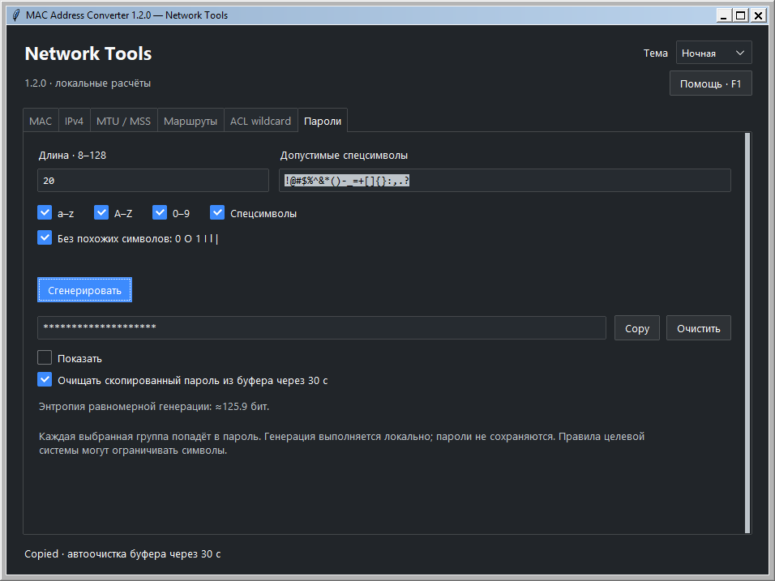
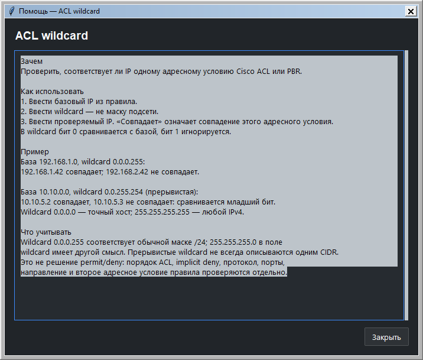

# Network Tools

Локальная Windows-утилита для сетевого инженера: MAC, IPv4, MTU/MSS, маршруты,
ACL запросов/ответов и генератор паролей. Шесть вкладок, дневная и ночная темы, расчёт при вводе и
копирование результатов. Для готового EXE установка Python не требуется.

[Скачать релиз v1.3.0](https://github.com/F1ourish/network-tools/releases/tag/v1.3.0).
В ZIP находятся EXE, краткая инструкция, лицензии и отчёт проверки.
Отдельно доступны EXE и `SHA256SUMS.txt`. Итоги проверки -
[отчёт проверки](docs/VALIDATION_1_3_0.md).

## Возможности

| Вкладка | Возможности и пример |
| --- | --- |
| MAC | Cisco, Colon, Hyphen, Plain; lowercase/uppercase. `0011.2233.aabb` → `00:11:22:33:aa:bb` |
| IPv4 | IP или CIDR, выбор `/0`-`/32` или полная маска; subnet, binary mask, wildcard, broadcast, диапазон и страницы хостов. По умолчанию `192.168.1.0/24` |
| MTU / MSS | IP MTU / Ethernet payload / кадр с FCS; dot1q/QinQ, PPPoE, IP-in-IP, GRE, WireGuard, VXLAN, ESP, OpenVPN UDP AEAD и L2TP/IPsec; состав overhead и MSS |
| Маршруты | Список CIDR с подписями, longest prefix match, все совпадения и равные наиболее специфичные кандидаты |
| ACL | Два списка Cisco IOS IPv4 ACL для запроса и ответа; source/destination, TCP/UDP, порты, первый permit/deny, sequence number, implicit deny и причина решения. Проверка одного wildcard сохранена отдельно |
| Пароли | CSPRNG, длина 8-128, выбранные группы и исключения, скрытие/показ, Copy и автоочистка буфера |

## Пароли и помощь

Шестая вкладка создаёт случайный пароль через системный CSPRNG (`secrets`).
Длина 8-128 (по умолчанию 20); выбор a-z/A-Z/цифр/спецсимволов; каждая выбранная
группа обязательна. Спецсимволы можно задать вручную. По умолчанию исключены
`0 O 1 I l |`; пробелы и Unicode не используются. Пароль скрыт, Copy копирует
сам результат. Изменение параметров очищает результат; «Очистить» также пытается
очистить свой пароль из буфера. Настройки сохраняют только тему.

Автоочистка буфера по умолчанию через 30 с: чужой новый текст не удаляется.
Она работает, пока приложение открыто; при закрытии выполняется попытка очистки.
История и синхронизация буфера Windows остаются вне контроля приложения;
надёжное затирание памяти Python не заявлено. Ошибка CSPRNG останавливает генерацию.
Оценка в битах - энтропия равномерного пространства генерации, без оценки времени взлома.
Обоснование выбора источника: [официальная документация Python secrets](https://docs.python.org/3.12/library/secrets.html).

Кнопка **«Помощь · F1»** открывает назначение, шаги, пример и ограничения текущего
инструмента. В справке маршрутов приведён готовый список CIDR и объяснён `[LPM]`;
в ACL - готовый пример запроса/ответа HTTPS, порядок правил, порты и неявный deny;
в MTU - выбор слоя, профилей VPN и состава overhead.
Справка доступна offline, прокручивается, следует за вкладкой и закрывается Escape.

## Интерфейс

Снимки готового EXE 1.3.0 доступны в [успешной Windows-проверке](https://github.com/F1ourish/network-tools/actions/runs/37611845777)
(artifact verification). Ниже сохранены снимки версии 1.2.0:





## Использование

Распаковать ZIP в пользовательский каталог и запустить `MacAddressConverter.exe`.
Можно переносить один EXE. Приложение не устанавливает драйверы или службы.
Выбрать вкладку и ввести значения: результат обновляется сразу. При ошибке
старые значения очищаются, копирование отключается. Readonly-поля позволяют
выделить и скопировать значение; Copy рядом с полем копирует только его.

Кнопка «Вставить» заменяет поле текстом из буфера. Ctrl+V, Shift+Insert и
«Вставить» в меню правой кнопки вставляют в позицию курсора или вместо выделения.
Работают многострочные маршруты и ACL; однострочные поля отвергают список строк.
Ctrl+A/C/V/X и основные сочетания вкладок работают также в русской раскладке Windows.

IPv4 принимает `10.20.30.40/16` и автоматически синхронизирует маску.
Обычный режим вычисляет сеть для IP хоста. Флажок «Проверить именно адрес сети»
показывает ошибку, если у введённого адреса есть host bits.
Список хостов открывается отдельным окном по 100 адресов; доступны переход
по номеру и копирование страницы. Окно показывает снимок выбранной подсети.

| Клавиши | Действие |
| --- | --- |
| Ctrl+1 … Ctrl+6 | Выбрать одну из шести вкладок |
| F1 | Контекстная помощь для активной вкладки |
| Ctrl+L | Выделить первое поле текущей вкладки |
| Ctrl+A, Ctrl+C, Ctrl+V | Выделение, копирование, вставка в поле |
| Ctrl+Shift+C | Копировать результат текущего инструмента |
| Ctrl+Shift+T | Переключить дневную/ночную тему |

## Правила расчётов

- MAC: ровно 12 ASCII hex; внутри допустимы `.`, `:`, `-` и ASCII-пробел.
  Проверяется синтаксис MAC-48; OUI, multicast и назначение адреса не определяются.
- IPv4: четыре октета без ведущих нулей. Полная маска должна содержать
  непрерывные единицы перед нулями; wildcard в поле маски не принимается.
- `/31`: оба адреса для point-to-point, без направленного broadcast.
  `/32`: один адрес, без broadcast подсети. `/0`: весь блок IPv4, включая
  специальные адреса; число адресов не выдаётся за число пригодных хостов.
  Для остальных префиксов число хостовых позиций - арифметическое `2^(32-p)-2`;
  это не проверка допустимости конкретной сети или адреса для оборудования.
- MTU: исходный размер явно относится к IP, Ethernet payload или кадру с FCS.
  Внешние VLAN-теги добавляют 4/8 байт к кадру; известный IP MTU не уменьшается.
  PPPoE 6 + PPP 2 вычитаются из L2 budget; известный IP MTU не уменьшается повторно.
  Профили учитывают внутренний/внешний IPv4/IPv6, дополнительные GRE-поля,
  внутренний Ethernet VXLAN/TAP, выбранные ESP IV/ICV/padding и NAT-T.
  OpenVPN: UDP AEAD DATA_V1/V2 без compression/fragmentation. L2TPv2: ESP transport,
  без Offset, размер PPP 1/2/4 по ACFC/PFC. Другие варианты задаются вручную.
  MSS = внутренний MTU минус фиксированные IP (20/40) и TCP (20) заголовки.
  Path MTU не измеряется; опции IP/TCP уменьшают TCP payload отдельно.
- Маршруты: одна выровненная сеть CIDR на строку, затем необязательная подпись.
  `#` начинает комментарий. Проверяется максимум 10000 строк введённого списка;
  VRF, PBR, AD/metric, рекурсия и реальный forwarding устройства не моделируются.
- ACL: standard/extended Cisco IOS IPv4, raw permit/deny, access-list, ip access-list
  и поддерживаемый show access-lists; host/any/wildcard, eq/neq/lt/gt/range,
  известные имена портов, remark, log и TCP established. Первый match решает,
  иначе implicit deny. Sequence number задаёт порядок независимо от порядка вставки.
  Во второй ACL проверяется ответ со сменой IP/портов и ACK=1 для TCP.
  Порт источника можно оставить пустым; если он нужен правилу, вердикт не угадывается.
  Пустая вторая ACL означает «ответ не проверен». Неподдерживаемые object-group,
  time-range, fragments и неизвестные условия дают ошибку всего списка.
  Лимит: 10000 строк / 1 МБ на ACL. NAT, маршрутизация, фрагментация и stateful
  firewall не моделируются; established проверяет ACK/RST, а не наличие соединения.

## Темы и данные

Выбор темы сохраняется в `%APPDATA%\MacAddressConverter\settings.json`.
Сохраняется только `day`/`night`. Введённые адреса, маршруты и результаты
не записываются в историю, файлы или логи. Приложение работает без сети.
В системном clipboard могут действовать собственные настройки Windows.
Повреждённые настройки темы дают дневную тему; ошибка записи не блокирует работу.
При старте onefile EXE распаковывает свой Python/Tcl/Tk runtime в TEMP.

## Запуск из исходников

Windows, PowerShell в корне репозитория; CPython 3.12 x64 с Tcl/Tk:

```powershell
py -3.12 -m venv .venv
.\.venv\Scripts\python.exe -m pip install -r requirements-dev.txt
.\.venv\Scripts\python.exe -m pip install --no-build-isolation -e .
.\.venv\Scripts\python.exe -m mac_converter
```

Активация venv и изменение ExecutionPolicy не нужны. CLI для MAC сохранён:

```powershell
.\.venv\Scripts\python.exe -m mac_converter.cli aabb.ccdd.eeff --format hyphen --upper
```

## Проверка и сборка

```powershell
.\.venv\Scripts\python.exe -m pytest -q --require-gui
.\.venv\Scripts\python.exe -m ruff check src tests scripts packaging/gui_entry.py
.\.venv\Scripts\python.exe -m ruff format --check src tests scripts packaging/gui_entry.py
.\.venv\Scripts\python.exe scripts/build_windows.py
```

Сборка требует Windows CPython **3.12.10 x64**, закреплённых зависимостей и
интерактивного desktop. Скрипт запускает тесты GUI, PyInstaller и настоящий EXE
от стандартной учётной записи, затем формирует ZIP и SHA-256.
Linux проверяет логику командой `python -m pytest -q -m "not gui"`.
Без Tk-дисплея обычный pytest пропускает GUI; `--require-gui` запрещает такой пропуск.

Кандидат 1.3.0 прошёл **480 тестов без ошибок и пропусков** (398 без GUI, 82 GUI)
и **44 проверки готового EXE** на Windows Server 2025 от стандартного пользователя.
Проверены оба направления ACL, порядок правил и implicit deny, неизвестный порт,
все профили MTU, VLAN/PPPoE, вставка и русская раскладка Windows.
[Успешный прогон](https://github.com/F1ourish/network-tools/actions/runs/37611845777) относится к commit `2a1bfa0e5b67d28cf2f5ae1496d4ad177b9a24a6`.
Перед публикацией CI повторяет все проверки и сборку для точного commit релиза.
Фактические числа тестов, исходный commit и среда находятся в
`RELEASE_VERIFICATION.json` релиза; контрольные суммы - в `SHA256SUMS.txt`.

[Процедура выпуска](docs/BUILD_AND_RELEASE.md), [архитектура](docs/ARCHITECTURE.md),
[клиентская проверка](docs/TESTING.md). Целевая среда - Windows 10/11 x64;
нативный стенд - Windows Server CI. Клиентские Windows, масштаб 125-200%,
Defender и SmartScreen требуют отдельной проверки. EXE без цифровой подписи.
Побайтовая идентичность независимых сборок не заявляется.

## Лицензии

Код приложения - [MIT](LICENSE). Runtime включает CPython, Tcl/Tk,
ttkbootstrap, Pillow и PyInstaller bootloader с собственными лицензиями.
Оригинальные notices сохранены в EXE и ZIP:
[THIRD_PARTY_NOTICES.md](THIRD_PARTY_NOTICES.md).
