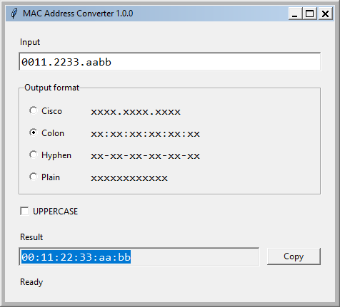

# MAC Address Converter

Небольшая локальная утилита на Python + Tkinter для преобразования MAC-48
между Cisco, Colon, Hyphen и Plain. Формат ввода определяется автоматически;
формат вывода по умолчанию — Colon, lowercase.

**Версия 1.0.0, проверено 05.10.2026:** Windows x64 EXE собран и фактически
запущен в [успешном CI](https://github.com/F1ourish/mac-address-converter/actions/runs/37349926876):
**81 pytest-тест и 19 проверок готового EXE прошли**. Запуск от обычной учётной
записи без повышения прав и загрузка встроенного Python/Tcl/Tk подтверждены.
Проверенная среда — Windows Server 2025; Windows 10/11 и разные DPI ещё требуют
отдельной проверки. Подробности — в [отчёте](docs/VALIDATION_2026-10-05.md).

## Возможности

- Автоматическая нормализация без ручного выбора формата ввода.
- Четыре формата вывода, переключение UPPERCASE и live conversion.
- Проверка ровно 12 ASCII hexadecimal символов; понятные ошибки без traceback.
- Поле Result доступно для выделения, Copy копирует только результат.
- Ctrl+C, Ctrl+V, Ctrl+A; Ctrl+L выделяет Input.
- GUI отделён от бизнес-логики; CLI использует тот же модуль.
- Нет внешних runtime-зависимостей, сети, телеметрии, истории и настроек.
- Onefile/windowed сборка `MacAddressConverter.exe` с `asInvoker`.

## Примеры

| Input | Output format | Result |
| --- | --- | --- |
| `0011.2233.aabb` | Colon | `00:11:22:33:aa:bb` |
| `00:11:22:33:aa:bb` | Cisco | `0011.2233.aabb` |
| `0011 2233 aabb` | Hyphen | `00-11-22-33-aa-bb` |
| `AABB.CCDD.EEFF` | Plain | `aabbccddeeff` |
| `aabb.ccdd.eeff` | Hyphen + UPPERCASE | `AA-BB-CC-DD-EE-FF` |

Начальные/конечные whitespace удаляются. Внутри значения допускаются `.`, `:`,
`-` и обычный ASCII-пробел, в том числе смешанные разделители. Внутренние табуляции,
переносы строк, NBSP, Unicode lookalikes, `0x` и 64-битные EUI-64 не принимаются.
Проверяется синтаксис, а не назначение адреса: broadcast/multicast и нулевой MAC
не запрещаются. Bulk conversion и OUI lookup не входят в v1.0.

## Скриншот



Скриншот реально запущенного EXE на Windows Server 2025 в CI.

## Запуск готовой версии

Скачать и распаковать
[проверенный Windows artifact](https://github.com/F1ourish/mac-address-converter/actions/runs/37349926876/artifacts/11362132391).
Запустить `dist/MacAddressConverter.exe` двойным кликом. Можно скопировать только
этот EXE в пользовательский каталог; installer и установка Python не нужны.
Манифест `asInvoker` и фактический токен процесса подтверждают запуск без elevation.
Artifact доступен владельцу приватного репозитория и хранится до 04.11.2026.

GitHub Release пока не опубликован. Целевая среда — Windows 10/11 x64;
результаты и оставшиеся проверки перечислены в [чеклисте](docs/TESTING.md).

## Запуск из исходников

Где выполнять: PowerShell в корне репозитория, Windows с CPython 3.12 x64
и установленным Tcl/Tk. Эти команды относятся к разработке, не к конечному пользователю EXE.

```powershell
py -3.12 -m venv .venv
.\.venv\Scripts\python.exe -m pip install -r requirements-dev.txt
.\.venv\Scripts\python.exe -m pip install --no-build-isolation -e .
.\.venv\Scripts\python.exe -m mac_converter
```

Активировать venv и менять PowerShell ExecutionPolicy не требуется.
Для CLI из исходников:

```powershell
.\.venv\Scripts\python.exe -m mac_converter.cli 0011.2233.aabb --format colon
.\.venv\Scripts\python.exe -m mac_converter.cli aabb.ccdd.eeff --format hyphen --upper
.\.venv\Scripts\python.exe -m mac_converter.cli --version
```

CLI также доступен как `macconv` после установки пакета. Отдельный portable
CLI EXE в v1.0 не поставляется; GUI EXE не принимает CLI-аргументы.

## Tests и проверки качества

Где выполнять: корень репозитория, тот же venv.

```powershell
.\.venv\Scripts\python.exe -m pytest -q --require-gui
.\.venv\Scripts\python.exe -m ruff check src tests scripts packaging/gui_entry.py
.\.venv\Scripts\python.exe -m ruff format --check src tests scripts packaging/gui_entry.py
```

`--require-gui` делает отсутствие Tk-дисплея ошибкой. При обычном `pytest -q`
GUI-тесты пропускаются без дисплея; такие результаты не доказывают работоспособность GUI.

Для проверки только логики на Linux без Tk-дисплея:

```bash
python -m pytest -q tests/test_mac.py tests/test_cli.py tests/test_release.py
```

## Build

Среда release-сборки: **Windows CPython 3.12.10 x64**, зависимости закреплены
в `requirements-dev.txt`. Из корня репозитория:

```powershell
.\.venv\Scripts\python.exe scripts/build_windows.py
```

Скрипт выполняет pytest с обязательным GUI, затем точную команду PyInstaller:

```powershell
.\.venv\Scripts\python.exe -m PyInstaller --clean --noconfirm mac-converter.spec
```

После сборки создаёт `dist/SHA256SUMS.txt` и проверяет **собранный EXE** отдельным
Win32 harness. Успешный результат — EXE и успешный `smoke-results/windows-exe.json`.
Также сохраняется настоящий `smoke-results/windows-exe.png`.
Локальную сборку запускать из обычного PowerShell без elevation: smoke проверяет
реальные права процесса. В hosted CI для этого временно создаётся обычная
учётная запись; эта инфраструктура не входит в приложение.

`.spec` намеренно сохранён в репозитории: onefile, `console=False`, без UPX,
встроенный манифест `asInvoker`, version resource из `__version__`.
Процедура воспроизводима по шагам и закреплённым версиям, но идентичность байтов
двух независимых сборок не заявляется.

## CI и release

GitHub Actions запускается на push, pull_request, тегах `v*` и вручную.
Linux job проверяет код и логику. Windows job выполняет GUI-тесты,
PyInstaller, smoke test EXE и upload artifact. Smoke test требует рабочего
Windows desktop; при его отсутствии pipeline должен завершиться ошибкой.
Workflow фактически выполнен: [проверенный запуск](https://github.com/F1ourish/mac-address-converter/actions/runs/37349926876).

Тег релиза должен совпадать с версией кода (`v1.0.0` для текущей версии).
Автоматическая публикация GitHub Release на push не настроена.
Порядок проверки и создания release — [build/release runbook](docs/BUILD_AND_RELEASE.md).

## Структура

| Путь | Назначение |
| --- | --- |
| `src/mac_converter/mac.py` | Нормализация, validation, форматирование |
| `src/mac_converter/gui.py` | Tkinter GUI, live conversion, clipboard |
| `src/mac_converter/main.py`, `__main__.py` | GUI entry points |
| `src/mac_converter/cli.py` | CLI поверх того же MAC API |
| `tests/` | Unit, GUI и release-tag tests |
| `packaging/`, `mac-converter.spec` | Windows entry, manifest, PyInstaller configuration |
| `scripts/` | Сборка, проверка EXE и release tag |
| `.github/workflows/build.yml` | Tests, Windows build, artifact |
| `docs/` | Архитектура, проверка, эксплуатационная процедура |

## Privacy

Введённый MAC не записывается в файлы или логи; приложение не использует сеть.
Copy помещает результат в системный clipboard. Его дальнейшее хранение,
например в Windows clipboard history, определяется настройками самой Windows.

## Лицензия

Код приложения — MIT, см. [LICENSE](LICENSE). В bundled runtime действуют
лицензии Python и Tcl/Tk; заметки для распространения —
[THIRD_PARTY_NOTICES.md](THIRD_PARTY_NOTICES.md).
